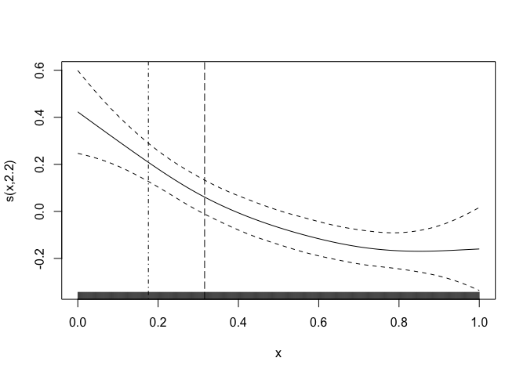

Semi-parametric Benchmark Dosing with semibmd
================
Alex Stringer
2023-01-12

# Install the `semibmd` package

The package is hosted at <https://github.com/awstringer1/semibmd>. It’s
currently a private repo so you can’t install using
e.g. `remotes::install_github`. Instead, clone the repository to a local
directory, say `~/work/projects/benchmark-dose/code/semibmd` for
example, and then in `R` do:

``` r
install.packages(pkgs='~/work/projects/benchmark-dose/code/semibmd',repos=NULL,type='source')
library(semibmd)
```

# Simulate some data

Simulate some data to which the dose-response model is to be fit:

``` r
n <- 100
f <- function(x) 1/sqrt(x+.05)
xmin <- 0
xmax <- .2
xcov <- seq(xmin,xmax,length.out=n)
x1 <- runif(n,xmin,xmax)
x2 <- runif(n,xmin,xmax)
set.seed(43798)
dat <- data.frame(y = rnorm(n,f(xcov)+2*x1-x2,1),x = xcov,x1=x1,x2=x2)
head(dat)
```

    ##          y           x         x1         x2
    ## 1 5.761869 0.000000000 0.19493468 0.07789323
    ## 2 6.094853 0.002020202 0.04219268 0.09317832
    ## 3 4.980793 0.004040404 0.13237715 0.10287713
    ## 4 3.915523 0.006060606 0.05577983 0.14075035
    ## 5 2.175104 0.008080808 0.12675188 0.17042177
    ## 6 3.346316 0.010101010 0.11417753 0.09892756

The exposure variable is `x` and there are two additional variables `x1`
and `x2` that can be included in the model.

# Benchmark dosing

## Fit the model

Fit the dose-response model and calculate the benchmark dose
information:

``` r
mod <- benchmark_dose(y~s(x,bs='mpd')+x1+x2,
                      data=dat,
                      exposure = 'x',
                      x0=0,
                      p0=.05,
                      BMR=.05,
                      monotone = TRUE)
```

The first argument to `benchmark_dose` is a formula compatible with
`scam::scam` (if `monotone=TRUE`) or with `mgcv::gam` (if
`monotone=FALSE`). The `scam` package accepts formulas just like `gam`,
with the addition that terms you want to be monotone should have their
bases specified manually to be one of the special monotone spline basis.
See `?scam::scam` for a list. Here I chose `bs='mpd'` for “monotone
p-spline, decreasing”, to enforce a monotone-decreasing estimated curve.

If you choose `monotone = TRUE` then `scam` is used; I added the option
to choose `monotone=FALSE` and fit an ordinary `gam`, based on our
discussions. However, I have not yet tested this feature.

The rest of the arguments are fairly self-explanatory. You have to tell
it which variable is the exposure variable (that you want the BMD(L)
for) using `exposure=...`. You can look at `?benchmark_dose` for the
full documentation.

## Get the summaries

Summaries and plots are obtained the usual way:

``` r
summary(mod)
```

    ## ---
    ## Dose-response model summary:
    ## ---
    ## 
    ## Family: gaussian 
    ## Link function: identity 
    ## 
    ## Formula:
    ## y ~ s(x, bs = "mpd") + x1 + x2
    ## 
    ## Parametric coefficients:
    ##             Estimate Std. Error t value Pr(>|t|)    
    ## (Intercept)   4.1920     0.5348   7.838 6.41e-12 ***
    ## x1            3.1940     2.0581   1.552    0.124    
    ## x2           -1.4999     1.9450  -0.771    0.443    
    ## ---
    ## Signif. codes:  0 '***' 0.001 '**' 0.01 '*' 0.05 '.' 0.1 ' ' 1
    ## 
    ## Approximate significance of smooth terms:
    ##        edf Ref.df     F  p-value    
    ## s(x) 1.451  1.747 13.21 3.24e-05 ***
    ## ---
    ## Signif. codes:  0 '***' 0.001 '**' 0.01 '*' 0.05 '.' 0.1 ' ' 1
    ## 
    ## R-sq.(adj) =  0.291   Deviance explained = 31.6%
    ## GCV score =  1.239  Scale est. = 1.1839    n = 100
    ## 
    ## ---
    ## Benchmark dose summary:
    ## ---
    ##      bmd   bmdl
    ## 1 0.0253 0.0142
    ## ---

``` r
plot(mod)
```

<!-- -->

The `summary` method just appends the estimated BMD(L) onto the summary
from the dose-response model. The `plot` method just adds vertical lines
to the plotted `scam/gam` at the BMD and BMDL.

For more detailed access, you can get the actual fitted model using
`get_model(mod)` and the estimated BMD(L) using `get_bmd(mod)`.

## Regular non-monotone GAM

We can also fit a regular `gam` by setting `montone = FALSE`. In this
case, you change the basis in the formula to be something compatible
with `mgcv`:

``` r
mod <- benchmark_dose(y~s(x,bs='bs')+x1+x2, # B-spline
                      data=dat,
                      exposure = 'x',
                      x0=0,
                      p0=.05,
                      BMR=.05,
                      monotone = FALSE)
```

Summaries and plots are obtained the same way:

``` r
summary(mod)
```

    ## ---
    ## Dose-response model summary:
    ## ---
    ## 
    ## Family: gaussian 
    ## Link function: identity 
    ## 
    ## Formula:
    ## y ~ s(x, bs = "bs") + x1 + x2
    ## 
    ## Parametric coefficients:
    ##             Estimate Std. Error t value Pr(>|t|)    
    ## (Intercept)   2.3869     0.3015   7.917 4.34e-12 ***
    ## x1            3.1698     2.0580   1.540    0.127    
    ## x2           -1.5140     1.9480  -0.777    0.439    
    ## ---
    ## Signif. codes:  0 '***' 0.001 '**' 0.01 '*' 0.05 '.' 0.1 ' ' 1
    ## 
    ## Approximate significance of smooth terms:
    ##        edf Ref.df     F  p-value    
    ## s(x) 1.359  1.634 27.76 1.62e-07 ***
    ## ---
    ## Signif. codes:  0 '***' 0.001 '**' 0.01 '*' 0.05 '.' 0.1 ' ' 1
    ## 
    ## R-sq.(adj) =   0.29   Deviance explained = 31.4%
    ## GCV = 1.2394  Scale est. = 1.1854    n = 100
    ## ---
    ## Benchmark dose summary:
    ## ---
    ##      bmd   bmdl
    ## 1 0.0274 0.0172
    ## ---

``` r
plot(mod)
```

<!-- -->

# Alternative BMDL Calculation

I have added functionality for computing BMDLs using the delta method
and bootstrapping. The argument `BMDL` in the call to `benchmark_dose`
controls which BMDL(s) is/are calculated; current options are `all`
(default), `score` and `delta`. Note that the contents of the `bmdl`
slot in the output object is never anything other than the `score` BMDL;
the `delta` BMDL is stored elsewhere and accessed using a getter
function, see below.

The argument `boot` controls the number of (parametric) bootstrap
iterations, with default `0` meaning don’t bootstrap. Like the `delta`
BMDL, a bootstrapped BMDL will be stored elsewhere in the output object
and accessed using a getter.

Here is how to fit it:

``` r
mod <- benchmark_dose(y~s(x,bs='bs')+x1+x2,
                      data=dat,
                      exposure = 'x',
                      x0=0,
                      p0=.05,
                      BMR=.05,
                      monotone = TRUE,
                      BMDL = 'all',
                      boot = 200
)
```

The `summary` method still returns just the `score` BMDL. Here are the
various getter functions to get everything:

``` r
# BMD and score BMDL:
get_bmd(mod)
```

    ## [1] 0.02741399 0.01718625

``` r
# All BMDLs:
get_all_bmdl(mod)
```

    ##      score      delta  bootstrap 
    ## 0.01718625 0.01174707 0.01143073

# Errors and diagnostics

The `benchmark_dose` function does error checking/handling at each step
of the procedure and attempts to collate and report the errors in a safe
manner. If you get an actual exception thrown when using it, let me know
what it is and I’ll try and add it. You can see what errors were thrown
with the following:

``` r
get_errors(mod)
```

    ## [1] FALSE

This should return `FALSE` if no errors were thrown.

You can see diagnostics and approximation quantities too:

``` r
# Diagnostics: U at estimated BMD and Psi at estimated score BMDL.
# Both should be zero:
get_uxb(mod)
```

    ##            1 
    ## 2.012383e-08

``` r
get_psixl(mod)
```

    ##              1
    ## 1 -1.07866e-08

``` r
# Approximation quantities: variance and derivative of U at BMD (used for delta method)
get_approximations(mod)
```

    ##          Vn         Upn 
    ##  0.01087876 13.04831181

``` r
# Computation times of each step
get_computation_times(mod)
```

    ##       model         bmd  bmdl_score  bmdl_delta   bmdl_boot       total 
    ## 0.010703087 0.007566929 0.014806986 0.008208990 7.307726860 7.349012852
