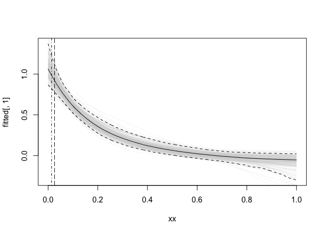

Semi-parametric Benchmark Dosing with semibmd
================
Alex Stringer
2023-11-15

# Install the `semibmd` package

The package is hosted at <https://github.com/awstringer1/semibmd> and
can be installed from there using either

``` r
remotes::install_github("awstringer1/semibmd")
```

or by cloning the repository to a local directory, say
`~/work/projects/benchmark-dose/code/semibmd` for example, and then
running:

``` r
install.packages(pkgs='~/work/projects/benchmark-dose/code/semibmd',repos=NULL,type='source')
library(semibmd)
```

This `README` illustrates the use of the package on a small, simulated
set of data.

# Simulate data

First, a function to set the parameters of the BMD analysis:

``` r
set_parameters_mono <- function(scale=1,sigma=1,p0=GLOBAL_P0,BMR=.025,plot_it=FALSE,knots=10) {
  xmin <- 0
  xmax <- 1
  # True function f
  stopifnot(scale>0)
  f <- function(x) exp(-x*scale)
  finv <- function(x) -log(x)/scale

  x0 <- 0
  stopifnot(x0>=xmin)
  tau0 <- f(x0) + sigma * qnorm(p0) # Response level
  stopifnot(abs(pnorm(tau0,f(x0),sigma) - p0) < sqrt(.Machine$double.eps)) # Definition of tau

  A <- qnorm(p0+BMR) - qnorm(p0)
  # Benchmark dose
  xb <- finv(f(x0) - sigma*A)
  stopifnot(abs(pnorm(tau0,f(xb),sigma) - (p0+BMR)) < sqrt(.Machine$double.eps)) # Definition of benchmark dose

  if (plot_it) {
    curve(f,xmin,xmax,ylim=c(0,1))
    abline(v=xb,lty='dashed')
    cat("xb = ",xb,"; f'(xb)/sigma = ",numDeriv::grad(f,xb)/sigma,".\n",sep="")
  } else {
    list(
      xmin = xmin,xmax = xmax,
      sigma = sigma,
      p0 = p0,BMR = BMR,
      f = f,
      x0 = x0,
      tau0 = tau0,
      A = A,
      xb = xb,
      knots=knots
    )
  }
}
```

Now simulate a set of data. In this example the true dose-response curve
is monotone, and there are two other covariates whose associations with
the response are smooth and nonlinear.

``` r
simulate_data_multi <- function(n,params) {
  xcov <- with(params,seq(xmin,xmax,length.out=n))
  z1 <- with(params,runif(n,xmin,xmax))
  z2 <- with(params,runif(n,xmin,xmax))
  fz1 <- function(z) sin(2*pi*z)
  fz2 <- function(z) cos(2*pi*z)
  with(params,data.frame(y = rnorm(n,f(xcov)+fz1(z1)+fz2(z2),sigma),x = xcov,z1=z1,z2=z2))
}

set.seed(472398)
params3 <- set_parameters_mono(scale=5,sigma=.5,p0=.01,BMR=.01,knots=10)
dat3 <- simulate_data_multi(500,params3)
```

Now, fit the model using the `benchmark_dose_tmb` function. Remarks: -
You have to load `mgcv` in order to create the objects necessary to call
the `benchmark_dose_tmb`. This isn’t great design on my part and will
probably be changed later. - `monosmooths` takes a list of `mgcv` smooth
objects created using the `s` function in `mgcv`. Currently only a list
of length 1 is supported. This variable is the dose variable for which a
benchmark dose is to be reported. You **must** use `bs = 'bs'`, for
B-Splines, here. - `smooths` takes a list of any length containing
`mgcv` smooth objects, representing additional covariates to be included
in the model. This has only been tested for B-Splines (with `by`
variables though), but “should” work for any such smooth available in
`mgcv`. - `linearterms` allows inclusion of linear covariates in the
model.

See `?benchmark_dose_tmb` for full documentation.

``` r
library(mgcv) # For s()
mod2_tmb <- benchmark_dose_tmb(
  monosmooths = list(s(x,bs='bs')),
  smooths = list(s(z1,bs='bs'),s(z2,bs='bs')),
  linearterms = NULL,
  data = dat3,
  exposure = 'x',
  response = 'y',
  x0 = 0,
  p0 = .01,
  BMR = .01,
  verbose = TRUE,
  eps = 1e-06,
  maxitr = 10,
  bayes_boot = 1e03
)
```

The fitted model object has a summary and plot method:

``` r
summary(mod2_tmb)
```

    ## ---
    ## Dose-response model summary:
    ## ---
    ## [1] "Monotone Additive Model fit using Laplace-Approximate Marginal Likelihood in TMB"
    ## ---
    ## Benchmark dose summary:
    ## ---
    ##     bmd   bmdl
    ## 1 0.026 0.0142
    ## ---

``` r
params3$xb # True BMD
```

    ## [1] 0.02930584

The `plot` method works in a manner that will be familiar to `R` users:

``` r
plot(mod2_tmb)
```

<!-- --><!-- --><!-- -->

A user may want finer control over the plot data, to make them look
nice. You can call `plot` with `plot=FALSE` to get the data for the
plot, and then make the plot(s) yourself so you can add titles and so
on:

``` r
plotdata <- plot(mod2_tmb,plot=FALSE)
length(plotdata)
```

    ## [1] 3

``` r
Map(names,plotdata)
```

    ## $mono
    ## [1] "x"        "fitted"   "estimate" "lower"    "upper"   
    ## 
    ## $smooth_1
    ## [1] "x"        "fitted"   "estimate" "lower"    "upper"   
    ## 
    ## $smooth_2
    ## [1] "x"        "fitted"   "estimate" "lower"    "upper"

``` r
# Plot the monontone smooth
with(plotdata[[1]],plot(x,fitted[ ,1],type='l',col=scales::alpha('lightgrey',0.2),xlim = range(x),ylim = c(min(lower),max(upper)),main = "My custom plot title",xlab = "Exposure",ylab = "Response"))
M <- 100 # Or whatever
for (i in 2:M)
  with(plotdata[[1]],graphics::lines(x,fitted[ ,i],col=scales::alpha('lightgrey',0.2)))

with(plotdata[[1]],graphics::lines(x,estimate))
with(plotdata[[1]],graphics::lines(x,lower,lty='dashed'))
with(plotdata[[1]],graphics::lines(x,upper,lty='dashed'))
with(plotdata[[1]],graphics::abline(v = get_bmd(mod2_tmb)[1],lty='longdash'))
with(plotdata[[1]],graphics::abline(v = get_bmd(mod2_tmb)[2],lty='dotdash'))
```

<!-- -->

The plot data for the other smooths is identical and is obtained by
accessing the remaining components of `plotdata`.
