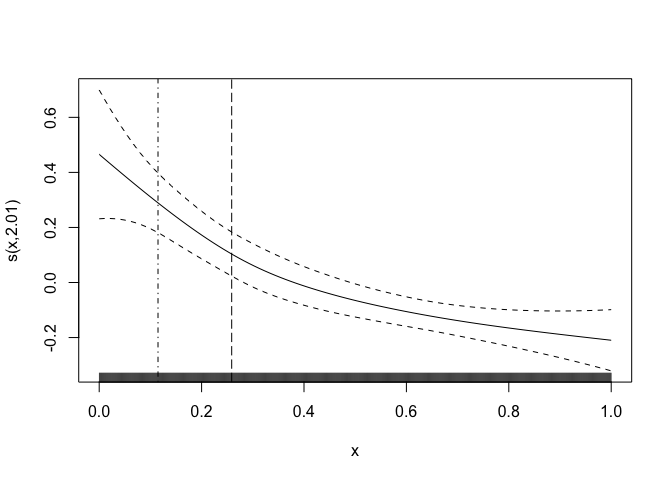

Semi-parametric Benchmark Dosing with semibmd
================
Alex Stringer
2022-11-24

# Install the `semibmd` package

The package is hosted at <https://github.com/awstringer1/semibmd>. It’s
currently a private repo so you can’t install using
e.g. `remotes::install_github`. Instead, clone the repository to a local
directory, say `~/work/projects/benchmark-dose/code/semibmd` for
example, and then in `R` do:

``` r
install.packages(pkgs='~/work/projects/benchmark-dose/code/semibmd',repos=NULL,type='source')
library(semibmd)
```

# Simulate some data

Simulate some data to which the dose-response model is to be fit:

``` r
n <- 100
f <- function(x) 1/sqrt(x)
xmin <- .05
xmax <- .2
xcov <- seq(xmin,xmax,length.out=n)
x1 <- runif(n,xmin,xmax)
x2 <- runif(n,xmin,xmax)
set.seed(43798)
dat <- data.frame(y = rnorm(n,f(xcov)+2*x1-x2,1),x = xcov,x1=x1,x2=x2)
head(dat)
```

    ##          y          x         x1         x2
    ## 1 5.587826 0.05000000 0.12789151 0.11785006
    ## 2 6.187403 0.05151515 0.05639754 0.05047859
    ## 3 5.029313 0.05303030 0.11152082 0.05341947
    ## 4 4.313252 0.05454545 0.19365742 0.07703448
    ## 5 2.216798 0.05606061 0.06642940 0.08218576
    ## 6 3.376902 0.05757576 0.08588071 0.10024173

The exposure variable is `x` and there are two additional variables `x1`
and `x2` that can be included in the model.

# Benchmark dosing

## Fit the model

Fit the dose-response model and calculate the benchmark dose
information:

``` r
mod <- benchmark_dose(y~s(x,bs='mpd')+x1+x2,
                      data=dat,
                      exposure = 'x',
                      x0=.05,
                      p0=.05,
                      BMR=.05,
                      monotone = TRUE)
```

The first argument to `benchmark_dose` is a formula compatible with
`scam::scam` (if `monotone=TRUE`) or with `mgcv::gam` (if
`monotone=FALSE`). The `scam` package accepts formulas just like `gam`,
with the addition that terms you want to be monotone should have their
bases specified manually to be one of the special monotone spline basis.
See `?scam::scam` for a list. Here I chose `bs='mpd'` for “monotone
p-spline, decreasing”, to enforce a monotone-decreasing estimated curve.

If you choose `monotone = TRUE` then `scam` is used; I added the option
to choose `monotone=FALSE` and fit an ordinary `gam`, based on our
discussions. However, I have not yet tested this feature.

The rest of the arguments are fairly self-explanatory. You have to tell
it which variable is the exposure variable (that you want the BMD(L)
for) using `exposure=...`. You can look at `?benchmark_dose` for the
full documentation.

## Get the summaries

Summaries and plots are obtained the usual way:

``` r
summary(mod)
```

    ## ---
    ## Dose-response model summary:
    ## ---
    ## 
    ## Family: gaussian 
    ## Link function: identity 
    ## 
    ## Formula:
    ## y ~ s(x, bs = "mpd") + x1 + x2
    ## 
    ## Parametric coefficients:
    ##             Estimate Std. Error t value Pr(>|t|)    
    ## (Intercept)   4.3081     0.4825   8.928 2.99e-14 ***
    ## x1            3.5409     2.4277   1.459    0.148    
    ## x2           -3.9535     2.4216  -1.633    0.106    
    ## ---
    ## Signif. codes:  0 '***' 0.001 '**' 0.01 '*' 0.05 '.' 0.1 ' ' 1
    ## 
    ## Approximate significance of smooth terms:
    ##      edf Ref.df     F  p-value    
    ## s(x)   1      1 38.05 1.21e-08 ***
    ## ---
    ## Signif. codes:  0 '***' 0.001 '**' 0.01 '*' 0.05 '.' 0.1 ' ' 1
    ## 
    ## R-sq.(adj) =  0.2875   Deviance explained = 30.9%
    ## GCV score = 1.2088  Scale est. = 1.1604    n = 100
    ## 
    ## ---
    ## Benchmark dose summary:
    ## ---
    ##      bmd   bmdl
    ## 1 0.0757 0.0695
    ## ---

``` r
plot(mod)
```

<!-- -->

The `summary` method just appends the estimated BMD(L) onto the summary
from the dose-response model. The `plot` method just adds vertical lines
to the plotted `scam/gam` at the BMD and BMDL.

For more detailed access, you can get the actual fitted model using
`get_model(mod)` and the estimated BMD(L) using `get_bmd(mod)`.
